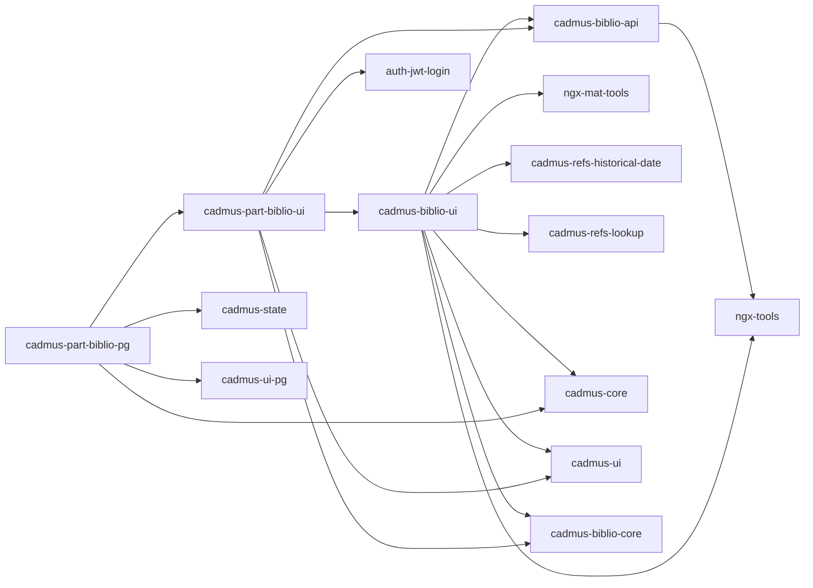

# Cadmus Biblio Shell

This project was generated using [Angular CLI](https://github.com/angular/angular-cli) version 19.0.6.

Cadmus frontend components for [external bibliography](https://github.com/vedph/cadmus_biblioapi).

🐋 Quick Docker image build:

1. update [env.js](src/env.js) version number and `npm run build-lib` (run [publish.bat](publish.bat) if required);
2. `ng build --configuration=production`;
3. `docker build . -t vedph2020/cadmus-biblio-shell:5.1.1 -t vedph2020/cadmus-biblio-shell:latest` (replace with the current version).

This project was generated with [Angular CLI](https://github.com/angular/angular-cli) version 11.0.5.

## Libraries



## History

### 12.0.1

- 2025-11-23:
  - ⚠️ upgraded to Angular 21.
  - migrated to `pnpm`.

### 12.0.0

- 2025-08-06: ⚠️ untied language from ISO639-3 (`@myrmidon/cadmus-biblio-ui`, `@myrmidon/cadmus-part-biblio-ui`, `@myrmidon/cadmus-part-biblio-pg`).
- 2025-08-02: updated Angular and packages.
- 2025-07-16: ⚠️ updated packages and bumped all major versions.

### 11.0.0

- 2025-06-03:
  - ⚠️ upgraded to Angular 20.
  - better loading message.
- 2025-05-06: updated Angular and packages.

### 10.0.0

- 2025-03-18: updated Angular and packages (major versions of Cadmus packages).

### 9.0.0

- 2025-01-27:
  - ⚠️ migrated to signals. Note that this did not affect `cadmus-biblio-core` and `cadmus-biblio-api`.
  - updated Angular and packages.

### 8.0.0

- 2025-01-04:
  - ⚠️ converted to standalone.
  - ⚠️ updated [Cadmus dependencies](https://github.com/vedph/cadmus-shell-v3) to version 11 (standalone components).

### 7.0.0

- 2024-12-06:
  - ⚠️ upgraded to new core dependencies.
  - M3 theme.

### 6.0.0

- 2024-11-19: ⚠️ upgraded to .NET 9.
- 2024-11-18: updated Angular and packages.

### 5.1.1

- 2024-06-08:
  - updated Angular and packages.
  - added `class="mat-X"` for each `color="X"` (e.g. `class="mat-primary"` wherever there is a `color="primary"`) to allow transitioning to Angular Material M3 from M2. This also implies adding it directly to the target element, so in the case of `mat-icon` inside a button with color the class is added to `mat-icon` directly (unless the button too has the same color). This allows to keep the old M2 clients while using the new M3, because it seems that the compatibility mixin is not effective in some cases like inheritance of color, and in the future `color` will be replaced by `class` altogether.
  - migrated to new control flow syntax (`@myrmidon/cadmus-biblio-ui`).
  - fixes to Docker image scripts.

### 5.1.0

- 2024-05-24:
  - ⚠️ upgraded to Angular 18 and updated packages, bumping all libraries version numbers to 5.1.0.
  - replaced HTTP providers using functional providers and removing deprecated Angular HTTP module, e.g.:

    ```ts
    provideHttpClient(withInterceptors([authJwtInterceptor]))
    ```

- 2024-04-13: ⚠️ upgraded to [bricks V2](https://github.com/vedph/cadmus-bricks-shell-v2). Library major **version** bumped to 5.
- 2023-11-18: updated Angular.

### 4.0.0

- 2023-11-09: ⚠️ upgraded to Angular 17.
- 2023-08-29: updated Angular.

### 3.1.0

- 2023-07-29: added work and container links.
- 2023-07-28: added `datation` and `datationValue` to works and containers.

### 3.0.0

- 2023-06-16:
  - updated Angular and packages.
  - refactored Docker compose script for PostgreSQL.

### 2.0.0

- 2023-05-11: updated to Angular 16.

### 1.4.3

- 2023-02-20:
  - updated key generation algorithm to reflect API counterpart.
  - use lookup to display selected item (for container) or reset it when just picking an item (for authors).

### 1.4.2

- 2023-02-20: validation in work authors.

### 1.4.1

- 2023-02-20: fixed number field not displayed in work editor for containers.

### 1.4.0

- 2023-02-18:
  - added optional `yearPub2` to work/container.
  - added bibliography page.

### 1.3.0

- 2023-02-17:
  - updated Angular.
  - added enabled properties to work list.
  - replaced author picker and work picker with brick lookup.
  - added pipes to display work/author.
- 2023-01-24:
  - minor refactorings in work entries list and part editor.
  - fix to work list subscriptions.
  - added Cadmus components to demo frontend.
- 2023-01-10: close work editor when saved in biblio UI.

### 1.2.1

- 2023-01-09: updated Angular and packages.
- 2022-12-22: updated Monaco editor (changing glob as specified [here](https://github.com/atularen/ngx-monaco-editor)).
- 2022-12-21: updated Angular and packages.
- 2022-11-30: updated packages.
- 2022-11-22:
  - upgraded to Angular 15 adjusting UI.
  - removed `@angular/flex-layout`.
  - library versions bumped to 2.0.0.
- 2022-09-24:
  - scroll to work info/editor.
  - added container deletion capability to work list.
  - scroll work editor into view.
- 2022-09-15: updated Angular and Cadmus packages.
- 2022-07-14: upgraded Angular.

### 1.2.0

- 2022-06-11: upgraded to Angular 14 and dropped legacy dependency from CadmusMaterial.

### 1.1.3

- 2022-05-18: upgraded Angular.

### 1.1.2

- 2022-04-29: upgraded Angular and removed moment.

### 1.1.1

- updated Angular and Cadmus related packages.
