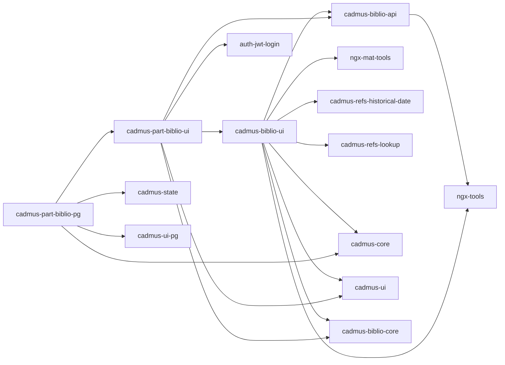

# Cadmus Biblio Shell

This project was generated using [Angular CLI](https://github.com/angular/angular-cli) version 19.0.6.

Cadmus frontend components for [external bibliography](https://github.com/vedph/cadmus_biblioapi).

🐋 Quick Docker image build:

1. update [env.js](src/env.js) version number and `pnpm run build-lib` (run [publish.bat](publish.bat) if required);
2. `ng build --configuration=production`;
3. `docker build . -t vedph2020/cadmus-biblio-shell:5.1.1 -t vedph2020/cadmus-biblio-shell:latest` (replace with the current version).

This project was generated with [Angular CLI](https://github.com/angular/angular-cli) version 11.0.5.

## Libraries

```mermaid
graph LR;
  cadmus-biblio-api --> ngx-tools
  cadmus-biblio-ui --> ngx-tools
  cadmus-biblio-ui --> ngx-mat-tools
  cadmus-biblio-ui --> cadmus-refs-historical-date
  cadmus-biblio-ui --> cadmus-refs-lookup
  cadmus-biblio-ui --> cadmus-core
  cadmus-biblio-ui --> cadmus-ui
  cadmus-biblio-ui --> cadmus-biblio-api
  cadmus-biblio-ui --> cadmus-biblio-core
  cadmus-part-biblio-ui --> auth-jwt-login
  cadmus-part-biblio-ui --> cadmus-ui
  cadmus-part-biblio-ui --> cadmus-biblio-ui
  cadmus-part-biblio-ui --> cadmus-biblio-api
  cadmus-part-biblio-ui --> cadmus-biblio-core
  cadmus-part-biblio-pg --> cadmus-core
  cadmus-part-biblio-pg --> cadmus-state
  cadmus-part-biblio-pg --> cadmus-ui-pg
  cadmus-part-biblio-pg --> cadmus-part-biblio-ui
```
